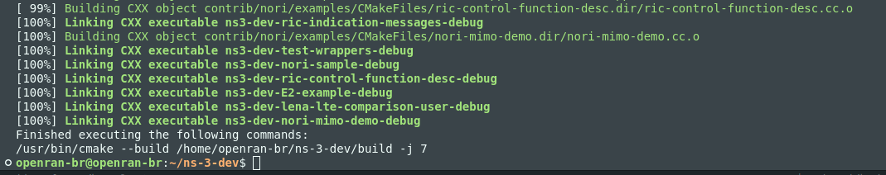

# OpenRAN@Brasil Blueprint-NORI v1
## Overview
The **blueprint-nori** is a new virtual machine image developed based on the [blueprint v1](https://github.com/LABORA-INF-UFG/openran-br-blueprint) originally released by the OpenRAN@Brasil program. While the initial version focused on the essential components for xApps development in the _Near-RT RIC_, the **blueprint-nori** expands the possibilities by integrating tools for **network simulation**, allowing researchers and developers to validate their scenarios more broadly and realistically.

### Key Features
- **ns-3 Simulator** with **nr 5G-LENA** support: enables the creation of advanced fifth-generation mobile network scenarios.  
- **NORI Module** (developed by our research group): integrates **ns-3** with the O-RAN architecture through the **e2sim_lib library**, allowing data exchange between the simulation environment and the _Near-RT RIC_.  
- **Functional Examples**:
    - **nori-sample**: demonstrates the basic functionality of the NORI module, with metric collection (_Key Performance Metrics, KPM_) and sending to the _Near-RT RIC_.  
    - **nori-mimo-demo**: explores complex 5G scenarios with _Multiple Input Multiple Output_ (MIMO), also integrating metrics to the _Near-RT RIC_.  

### Benefits
- **Unified Environment**: includes virtualization, ns-3, nr 5G-LENA, and the NORI module ready for use.  
- **Reduced Setup Time**: focuses directly on the development and evaluation of new 5G and O-RAN network functionalities.  
- **O-RAN Integration**: sends metrics to a running xApp in the _Near-RT RIC_ and provides flexibility to implement online control algorithms.  
- **Support for Advanced Scenarios**: from basic (nori-sample) to the use of MIMO techniques (nori-mimo-demo), ideal for realistic studies and experiments of mobile networks.

---

## Deploying Virtual Box

### Download and Configuration
1. Download the blueprint-nori from [blueprint-nori-v1](https://nextcloud.lasseufpa.org/s/b6sd42DKnFgmxmP).  
2. The blueprint is available in zip format, and when unzipped, it will occupy about 64GB of disk space.
3. In VirtualBox, add the virtual disk in Tools -> Media -> Add Disk Media and select the virtual disk you just downloaded.

### Creating the Virtual Machine

1. Open VirtualBox and click "New" to create a new virtual machine.
2. Give your virtual machine a name, select the type "Linux" and the version "Ubuntu (64-bit)".
    
3. Set the amount of RAM you want to allocate to the virtual machine (recommended: at least 6GB).
    
4. Select "Use an existing virtual hard disk file" and choose the virtual disk you added earlier.
    
5. Click "Create" to finalize the creation of the virtual machine.
    
6. With the virtual machine selected, click "Settings" and adjust the network settings to "Bridged Adapter" to allow communication with the external network.
    
7. Click "OK" to save the settings and then "Start" to power on the virtual machine.

### Quick Start

With the virtual machine ready, it can be accessed with user: openran-br and password: openran-br.
```bash
ssh openran-br@<VIRTUAL_MACHINE_IP>
# Password: openran-br
```

# Preparing ns-3

To run a first example, go to the main directory of ns-3:

```bash
cd ~/ns-3-dev/
```

Then configure and start the build of ns-3 with the following command:

```bash
bash config_build_ns3.sh 
```

If everything goes well, the output will be something like:



If any error occurs, try cleaning ns-3 with `./ns3 clean` and try configuring the build again.

# Running nori

Now we can run the nori examples. The first example will be the nori-sample, which consists of a gnb and a ue receiving udp packets.

```bash
bash run_nori_sample.sh
```

Or we can run a scenario with mimo with the command:

```bash
bash run_nori_mimo_demo.sh
```

The expected output is shown below:


If you receive a SETUP-RESPONSE-SUCCESS, the setup phase was successful and now the gnb is waiting for a subscription to start sending kpm metrics.

If you received a SETUP-RESPONSE-FAILURE, try deleting the xapp and redeploying the ric:

In `~/xapp-nori`, run `bash redeploy_ric.sh` to redeploy the ric and run the command below to uninstall the xapp if it is already running and try running the example again.

```bash
dms_cli uninstall xappnori ricxapp
```

# Running the Xapp

Open a second terminal to work with the xapp. Go to the xapp directory

```bash
cd ~/xapp-nori
```

To make the xapp perform a subscription, run the script

```bash
bash resubscribe.sh
```

In the ns-3 terminal, you will see the encoded RIC indication data that was sent, something like this:


The first RIC Indication message is sent as soon as the subscription is made, but on some occasions, the next messages may take from 10 seconds to 1 minute to start being sent and thus be displayed in the terminal.

---

## Contact Us
- **Research and Development Group**: [Openran@Brasil](https://openranbrasil.org.br/) 
- **Laboratory**: [LASSE - Núcleo de P&D em Telecomunicações, Automação e Eletrônica](https://www.lasse.ufpa.br/pt)  
- **Report Issues and Questions**: Open an [issue](https://github.com/lasseufpa/nori/issues) in this repository.

---
